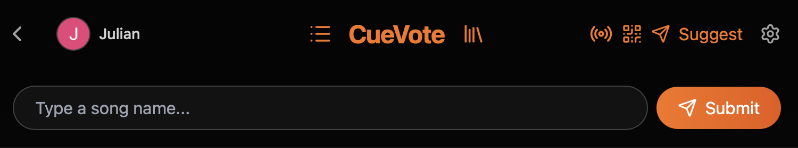

# CueVote - The Democratic Jukebox

**CueVote** is a modern, community-driven social jukebox built for the YouTube era. It democratizes music selection by allowing everyone in the room to suggest songs and vote on the queue in real-time.

Whether you're hosting a house party, running a bar, or just hanging out online, CueVote ensures the best songs play next — decided by the crowd, not an algorithm.

---

## 🚀 Core Features

### 🎧 Social Jukebox
*   **Democratic Queue:** Users vote songs up (Like) or down (Dislike). The highest-rated songs jump to the top.
*   **Collaborative Suggestions:** Anyone can search and add songs from YouTube.
*   **Real-Time Sync:** Queue updates, votes, and playback state sync instantly across all devices.

### 🏛️ Lobby & Discovery
*   **Public & Private Channels:** Create open rooms for everyone or password-protected private rooms for friends.
*   **Search & Filters:** Easily find active parties or filter by your own created channels.
*   **Personalized Experience:** Sign in with Google to track your history, favorite songs, and managed channels.

### 🧠 Smart Queue System
*   **Vote-Based Sorting:** The queue dynamically reorders itself based on live votes.
*   **Auto-Refill (Auto-DJ):** When the queue runs dry, the system intelligently picks songs from the room's history to keep the vibe going.
*   **Smart Replacement:** If the queue is full, new high-quality suggestions can replace the lowest-voted track automatically (optional).
*   **Duplicate Prevention:** Intelligent checks prevent the same song (or title) from being played too frequently.

### 📺 Playback Modes
*   **Host Mode (Venue/TV):** The "Main Screen" experience. Connect a laptop, TV, or projector to play the music and video.
    *   *Cinema Mode:* Full-screen immersive experience.
    *   *Venue Mode:* Specialized view for TVs that shows the playlist/QR code instead of just the video.
*   **Guest Mode:** Users join on their phones to view the queue, vote, and suggest without interrupting playback.
*   **Prelisten:** Guests can privately preview a song on their own device before voting it up.

### 🛡️ Moderation & Controls
*   **Owner Powers:**
    *   **Skip/Pause/Seek:** Full playback control.
    *   **Force Play:** Jump a specific song to "Now Playing" immediately.
    *   **Banning:** Ban specific songs from the session.
    *   **Manual Approval:** Switch to "Manual Mode" to review every suggestion before it hits the queue.
*   **System Integrity:**
    *   **Spam Protection:** Rate limits and duplicate cooldowns.
    *   **Content Filters:** Option to restrict to "Music Only" categories or limit song duration.

### 📚 Channel Library
*   **Track History:** The channel automatically remembers songs played in the past.
*   **Quick Add:** Easily re-add previously played songs to the queue without searching.

### ⚖️ Legal & Privacy
*   **GDPR Compliant:** Users have full control to request account deletion and data removal directly within the app.
*   **Transparency:** Dedicated Legal Center with Terms of Service, Privacy Policy, and Colophon.
*   **YouTube Compliance:** Uses the official YouTube iFrame API to ensure creators get views and ad revenue (if applicable).

---

## 🛠️ Technical Stack

*   **Frontend:** React, Tailwind CSS, Lucide Icons.
*   **Backend:** Node.js, WebSocket (`ws`), SQLite3.
*   **Database:** SQLite with WAL mode for high-performance, concurrent read/write operations.
*   **API:** YouTube Data API v3 for robust video metadata verification.

---

## 📦 Deployment (Brief)

CueVote is designed to be self-hosted or deployed on platforms like DigitalOcean, Heroku, or Railway.

1.  **Clone the repo**
2.  **Install dependencies:** `npm install` (root), `cd cuevote-server && npm install`, `cd cuevote-client && npm install`
3.  **Configure `.env`:** Add your `YOUTUBE_API_KEY` and `GOOGLE_CLIENT_ID`.
4.  **Build & Run:** `npm run build` and `npm start`.

*See `DEPLOYMENT.md` for full instructions.*

---

## 📜 Credits

Created by **Julian Zienert**  
jzienert@student.codam.nl  
Concept & Documentation © 2025

**Where community meets rhythm — every vote changes the beat.**
